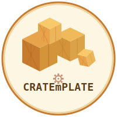

<p align="center">
  
</p>

# CRATEmPLATE

[](https://github.com/mlavrinenko/cratemplate/actions/workflows/ci.yml)
[](https://github.com/cargo-generate/cargo-generate)

An opinionated [cargo-generate](https://github.com/cargo-generate/cargo-generate) template for Rust projects.

## Usage

```bash
cargo generate gh:mlavrinenko/cratemplate
# or using nix:
nix run nixpkgs#cargo-generate -- generate --git https://github.com/mlavrinenko/cratemplate
```

You'll be prompted for project name, description, and license.

## What you get

- Rust 2024 edition with strict clippy lints
- Error handling with `anyhow` + `thiserror`
- CLI support via `clap`
- Nix flake dev environment (rustc, cargo, clippy, rustfmt, just, rust-analyzer, etc.)
- `Justfile` with common recipes (`just check`, `just test`, `just cover`, etc.)
- Code coverage via `cargo-tarpaulin` (70% minimum)
- File size limits enforced (500 lines for Rust, 200 for Markdown) // but it will be LoC check with `linecop` crate soon.
- `AGENT.md` with rules for LLM coding agents

## Template maintenance

After making changes to the template, validate that it still produces a working project:

```bash
just validate
```

This generates a project in a temp directory and runs fmt, clippy, tests, build, coverage, and file size checks against it.
